# Architecture Documentation - US State Information App

## System Architecture Overview

This document provides a comprehensive view of the app's architecture using UML diagrams.

## Class Diagram


## Sequence Diagram - Text Query Flow


## Sequence Diagram - Voice Query Flow


## Sequence Diagram - Guardrail Rejection Flow


## Component Architecture


## State Machine - Query State Flow

```mermaid
stateDiagram-v2
    [*] --> Idle: App Launch

    Idle --> Loading: User submits query

    Loading --> Success: Valid state query processed
    Loading --> Error: Guardrail rejection or error

    Success --> Idle: User resets or new query
    Error --> Idle: User taps "Try Again"
    Error --> Loading: User taps "Retry"

    Success --> Loading: User submits new query

    note right of Idle
        Empty state
        Input ready
    end note

    note right of Loading
        Progress indicator
        Processing query
    end note

    note right of Success
        Display map
        Show state info
    end note

    note right of Error
        Error message
        Retry option
    end note
```



## Data Flow Architecture

```mermaid
flowchart LR
    subgraph Input
        A[User Text Input]
        B[User Voice Input]
    end

    subgraph Processing
        C[StateQueryViewModel]
        D{Query Type?}
        E[Text Query]
        F[Speech Recognition]
    end

    subgraph Validation
        G[FoundationModelsService]
        H{Guardrail Check}
        I[Valid State Query]
        J[Invalid Query]
    end

    subgraph Generation
        K[FoundationModels API]
        L[@Generable Response]
        M[StateInformation]
    end

    subgraph Display
        N[ContentView]
        O[StateInformationView]
        P[StateMapView]
    end

    A --> C
    B --> F
    F --> C
    C --> D
    D --> E
    D --> F
    E --> G
    F --> G

    G --> H
    H -->|Yes| I
    H -->|No| J

    I --> K
    K --> L
    L --> M

    J --> N
    M --> N
    N --> O
    O --> P

    style H fill:#ffcccc
    style I fill:#ccffcc
    style J fill:#ffcccc
    style M fill:#ccccff
```

## Error Handling Flow


## Key Design Patterns

### 1. MVVM Pattern
- **Model**: `StateInformation` - Pure data structure
- **View**: SwiftUI views (ContentView, StateInputView, etc.)
- **ViewModel**: `StateQueryViewModel` - Business logic and state management

### 2. Service Layer Pattern
- `FoundationModelsService` - Encapsulates AI logic
- `SpeechRecognitionService` - Encapsulates speech recognition
- Clean separation from ViewModels

### 3. Strategy Pattern
- Query validation strategy (guardrails)
- Different input strategies (text vs. voice)

### 4. Observer Pattern
- SwiftUI's `@Observable` macro for reactive updates
- Automatic UI updates on state changes

### 5. Dependency Injection
- Services injected into ViewModel
- Easy to test and mock

## Concurrency Model


All async operations use Swift 6.2 modern concurrency:
- `async/await` for asynchronous calls
- `@MainActor` for UI updates
- `Sendable` for thread-safe data passing

## Security & Privacy


Privacy considerations:
- All permissions requested with clear explanations
- On-device FoundationModels processing
- No data sent to external servers
- User controls all data

---

## Summary

This architecture provides:
- **Separation of concerns** through MVVM
- **Type safety** with Swift 6.2 features
- **Testability** through service layer abstraction
- **Scalability** with clear component boundaries
- **Maintainability** through clean code organization
- **Production quality** with comprehensive error handling
